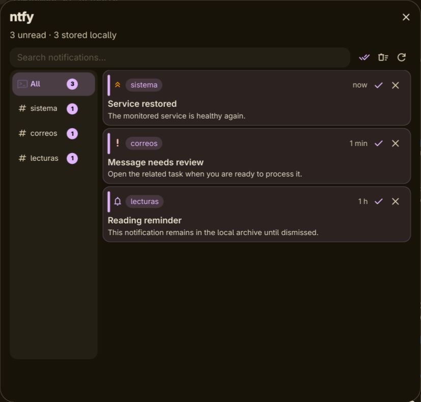

# dms-ntfy

A persistent [ntfy](https://ntfy.sh) review inbox for
[DankMaterialShell](https://danklinux.com).

The plugin is intentionally separate from the normal DMS notification center:
it does not create duplicate desktop notifications. A daemon polls the configured
topics and stores every message locally; a DankBar widget lets you review that
archive later.



## Features

- Official ntfy icon and unread badge in both horizontal and vertical DankBars.
- One **All** view plus a section for every configured or previously seen topic.
- Persistent local history: messages survive DMS restarts and the ntfy server's
  temporary message cache. Nothing is removed until you explicitly dismiss it
  (unless you opt into a history limit).
- Read/unread state, per-topic unread counters, full-text local search, manual
  refresh, mark-all-read, and two-step dismissal.
- Multi-select with checkboxes: select notifications one by one or all in the
  current view, then mark them read/unread or dismiss them in a single batch
  (dismissal asks for a confirming second click).
- The popout title is a link: click **dms-ntfy** to open the configured
  instance in your browser.
- Shows ntfy title, body, topic, priority, tags, source instance, exact timestamp,
  click URL, attachment, and safe `view` actions.
- HTTP and broadcast actions are described but never executed.
- **Multiple servers**: subscribe to any number of ntfy instances at once, each
  with its own topics and credentials. Messages from every server merge into the
  same archive and topic sections; each card shows its source instance.
- Works with ntfy.sh or any self-hosted instance, public topics, access tokens, or
  HTTP Basic authentication — chosen per server.
- Credentials are stored in the system keyring with `secret-tool` (one entry per
  server: key `token:<id>` or `password:<id>`), never in `plugin_settings.json`.
  Configurations from versions before 0.3.0 migrate automatically into a single
  server that keeps reading the original keyring entries.
- Composite architecture: one daemon owns polling and persistence while any
  number of horizontal/vertical widget instances share its live state.

## Requirements

- DankMaterialShell 1.5.0 or newer.
- `curl`, `secret-tool` (libsecret), and GNU `base64` on `PATH`.
- At least one ntfy topic with subscribe permission.

The client uses ntfy's documented JSON polling endpoint:
`/<topic1>,<topic2>/json?poll=1&since=<message-id>`. On first sync it imports all
messages still present in the server cache, then deduplicates them into the local
archive.

## Setup

1. Symlink or copy this directory to
   `~/.config/DankMaterialShell/plugins/ntfy`.
2. Scan plugins, enable **ntfy**, and add it to any DankBar:

   ```sh
   dms ipc plugin-scan scan
   ```

3. In Settings → Plugins → ntfy, add one card per server: URL, comma-separated
   topics, and the authentication method for that server.
4. Save each server's access token or password through the settings UI;
   alternatively, store it directly under that server's keyring key:

   ```sh
   secret-tool store --label='DMS ntfy token' service dms-ntfy key token:<id>
   secret-tool store --label='DMS ntfy password' service dms-ntfy key password:<id>
   ```

   The `<id>` of each server is visible in the `instances` entry of
   `plugin_settings.json` (a configuration migrated from 0.2.x keeps the id
   `main` and continues to read the original `token`/`password` keys).

Right-clicking the bar icon syncs immediately. Left-clicking opens the archive.

## IPC

```sh
dms ipc call ntfy status
dms ipc call ntfy refresh
dms ipc call ntfy markAllRead __all__
```

Mutation commands used by the UI (`markRead`, `markUnread`, `dismiss`,
`dismissRead`, and `clearHistory`) are also available over IPC, as are the batch
variants (`markReadMany`, `markUnreadMany`, `dismissMany`) that take a
newline-separated list of message uids. Dismissal is local: it does not delete
the original message from the ntfy server.

## Development

```sh
node tests/test-ntfy.js
jq . plugin.json
dms ipc plugin-scan rescan ntfy
dms ipc plugin-scan reload ntfy
```

Because the QML engine caches compiled components and imported JavaScript for
the lifetime of the process, `plugin-scan reload` is not enough to pick up code
changes in practice — restart the shell (`systemctl --user restart dms`) after
editing any `.qml` or `.js` file.

## Licensing

Plugin code is MIT licensed. `Images/ntfy-outline.svg` is the official ntfy outline
icon from `binwiederhier/ntfy`, used unmodified under Apache-2.0; see `NOTICE` and
`LICENSES/Apache-2.0.txt`.
